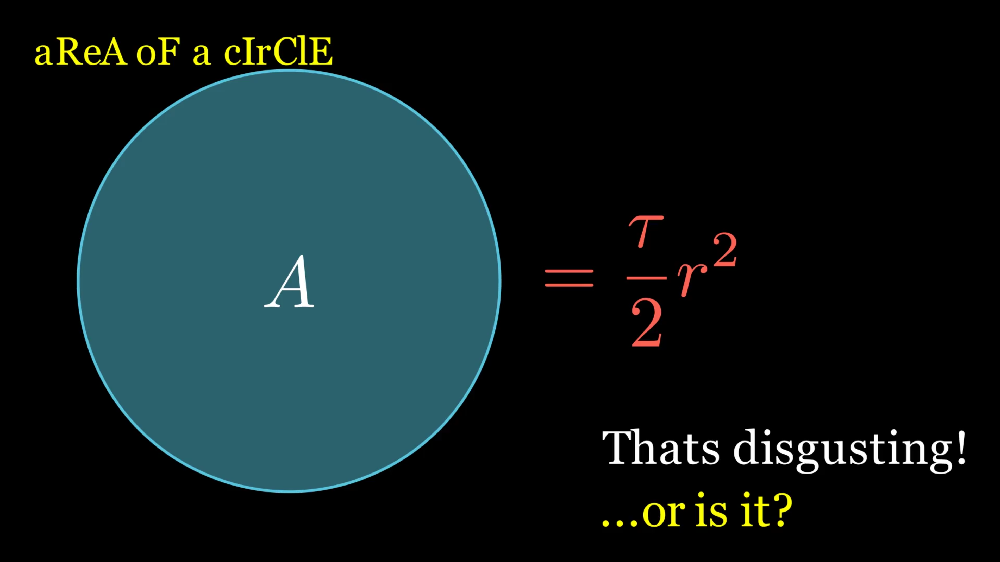
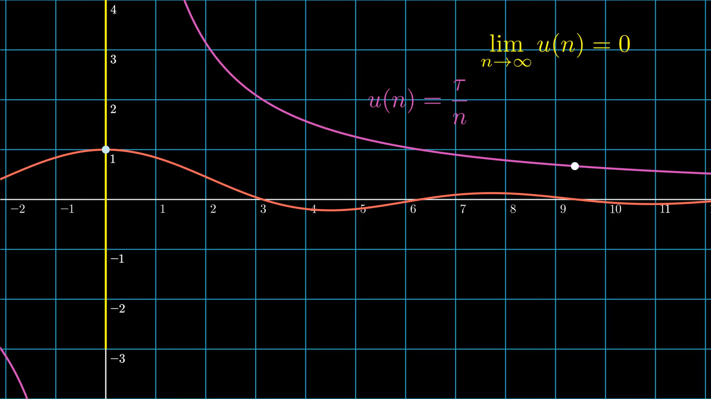
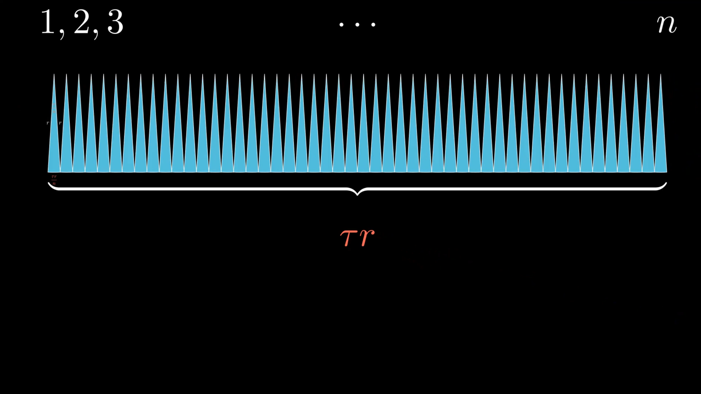

<!-- Improved compatibility of back to top link: See: https://github.com/othneildrew/Best-README-Template/pull/73 -->
<a name="readme-top"></a>
<!--
*** Thanks for checking out the Best-README-Template. If you have a suggestion
*** that would make this better, please fork the repo and create a pull request
*** or simply open an issue with the tag "enhancement".
*** Don't forget to give the project a star!
*** Thanks again! Now go create something AMAZING! :D
-->


<!-- PROJECT SHIELDS -->
<!--
*** I'm using markdown "reference style" links for readability.
*** Reference links are enclosed in brackets [ ] instead of parentheses ( ).
*** See the bottom of this document for the declaration of the reference variables
*** for contributors-url, forks-url, etc. This is an optional, concise syntax you may use.
*** https://www.markdownguide.org/basic-syntax/#reference-style-links
-->
[![Contributors][contributors-shield]][contributors-url]
[![Forks][forks-shield]][forks-url]
[![Stargazers][stars-shield]][stars-url]
[![Issues][issues-shield]][issues-url]
[![MIT License][license-shield]][license-url]


<!-- PROJECT LOGO -->
<br />
<div align="center">
  <a href="https://github.com/Sentientplatypus/circle-area-proof">
    
  </a>

<h3 align="center">A Vindication of the area of a circle with Tau</h3>

  <p align="center">
    A lot of people poop on tau / 2 r squared because it looks stupid. I think it actually slaps. My math teacher, Shaun Errichiello (also found in the acknowledgmeents section) told us we had to either write an essay or do a cool thing about this. But actually though, who would want to write an essay?
    <br /> 
    <a href="https://www.manim.community"><strong>Explore the docs »</strong></a>
    <br />
    <br />
    <a href="https://www.youtube.com/watch?v=Okraa2ZElrE">Watch the video!</a>
    ·
    <a href="https://github.com/Sentientplatypus/circle-area-proof/issues">Report Bug</a>
    ·
    <a href="https://github.com/Sentientplatypus/circle-area-proof/issues">Request Feature</a>
  </p>
</div>


<!-- TABLE OF CONTENTS -->
<details>
  <summary>Table of Contents</summary>
  <ol>
    <li>
      <a href="#about-the-project">About The Project</a>
      <ul>
        <li><a href="#built-with">Built With</a></li>
      </ul>
    </li>
    <li>
      <a href="#getting-started">Getting Started</a>
      <ul>
        <li><a href="#prerequisites">Prerequisites</a></li>
        <li><a href="#installation">Installation</a></li>
      </ul>
    </li>
    <li><a href="#usage">Usage</a></li>
    <li><a href="#roadmap">Roadmap</a></li>
    <li><a href="#contributing">Contributing</a></li>
    <li><a href="#license">License</a></li>
    <li><a href="#contact">Contact</a></li>
    <li><a href="#acknowledgments">Acknowledgments</a></li>
  </ol>
</details>


<!-- ABOUT THE PROJECT -->
## About The Project

[![Product Name Screen Shot][product-screenshot]](https://example.com)

When the inevitable Tau vs Pi discussion comes up, many people point to the area of a circle. They simply cannot accept that a fraction in a formula is cleaner, but it actually is. I explain it in the video.

<p align="right">(<a href="#readme-top">back to top</a>)</p>


### Built With

* [![Next][python]][python-url]
* Manim animation library

<p align="right">(<a href="#readme-top">back to top</a>)</p>


<!-- GETTING STARTED -->
## Getting Started

If you wish to recycle some of my animations, they are all found in the `Scenes` folder. 



### Prerequisites

You first need to install manim
* pip
  ```sh
  pip install manim
  ```

Additionally, you may need to install tex

### Installation


1. Clone the repo
   ```sh
   git clone https://github.com/Sentientplatypus/circle-area-proof.git
   ```


<p align="right">(<a href="#readme-top">back to top</a>)</p>


<!-- USAGE EXAMPLES -->
## Usage
When working with manimations, I found it incredibly helpful to use the manim extension in visual studio code found [here](https://marketplace.visualstudio.com/items?itemName=Rickaym.manim-sideview)

_For more examples, please refer to the [The Manim Documentation](https://www.manim.community)_

<p align="right">(<a href="#readme-top">back to top</a>)</p>


<!-- ROADMAP -->
## Roadmap

- [x] Introduction
- [x] Proof
- [x] conclusion
    - [x] fun ending

See the [open issues](https://github.com/Sentientplatypus/circle-area-proof/issues) for a full list of proposed features (and known issues).

<p align="right">(<a href="#readme-top">back to top</a>)</p>


<!-- CONTRIBUTING -->
## Contributing

Contributions are what make the open source community such an amazing place to learn, inspire, and create. Any contributions you make are **greatly appreciated**.

If you have a suggestion that would make this better, please fork the repo and create a pull request. You can also simply open an issue with the tag "enhancement".
Don't forget to give the project a star! Thanks again!

1. Fork the Project
2. Create your Feature Branch (`git checkout -b feature/AmazingFeature`)
3. Commit your Changes (`git commit -m 'Add some AmazingFeature'`)
4. Push to the Branch (`git push origin feature/AmazingFeature`)
5. Open a Pull Request

<p align="right">(<a href="#readme-top">back to top</a>)</p>


<!-- CONTACT -->
## Contact

Geneustace Wicaksono - [My Website](https://genewica.herokuapp.com) - geneustacewicaksono@yahoo.com

Project Link: [https://github.com/Sentientplatypus/circle-area-proof](https://github.com/Sentientplatypus/circle-area-proof)

<p align="right">(<a href="#readme-top">back to top</a>)</p>


<!-- ACKNOWLEDGMENTS -->
## Acknowledgments

* [Shaun Errichiello](https://twitter.com/shaunteaches?lang=en)
* my girlfriend for bearing with the days I was distracted with this haha.

<p align="right">(<a href="#readme-top">back to top</a>)</p>


<!-- MARKDOWN LINKS & IMAGES -->
<!-- https://www.markdownguide.org/basic-syntax/#reference-style-links -->
[contributors-shield]: https://img.shields.io/github/contributors/Sentientplatypus/circle-area-proof.svg?style=for-the-badge
[contributors-url]: https://github.com/Sentientplatypus/circle-area-proof/graphs/contributors
[forks-shield]: https://img.shields.io/github/forks/Sentientplatypus/circle-area-proof.svg?style=for-the-badge
[forks-url]: https://github.com/Sentientplatypus/circle-area-proof/network/members
[stars-shield]: https://img.shields.io/github/stars/Sentientplatypus/circle-area-proof.svg?style=for-the-badge
[stars-url]: https://github.com/Sentientplatypus/circle-area-proof/stargazers
[issues-shield]: https://img.shields.io/github/issues/Sentientplatypus/circle-area-proof.svg?style=for-the-badge
[issues-url]: https://github.com/Sentientplatypus/circle-area-proof/issues
[license-shield]: https://img.shields.io/github/license/Sentientplatypus/circle-area-proof.svg?style=for-the-badge
[license-url]: https://github.com/Sentientplatypus/circle-area-proof/blob/master/LICENSE.txt
[linkedin-shield]: https://img.shields.io/badge/-LinkedIn-black.svg?style=for-the-badge&logo=linkedin&colorB=555
[linkedin-url]: https://linkedin.com/in/linkedin_username
[product-screenshot]: image-2.png
[python]: https://img.shields.io/badge/Python-3776AB?style=for-the-badge&logo=python&logoColor=white
[python-url]: https://python.com

